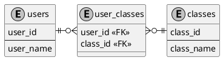

# ER図

```puml
@startuml
skinparam monochrome true

entity users {
    user_id
    --
    user_name
}

entity classes {
    class_id
    --
    class_name
}

entity user_classes {
    user_id <<FK>>
    class_id <<FK>>
}

users ||-o{ user_classes
user_classes }o-|| classes

@enduml
```
