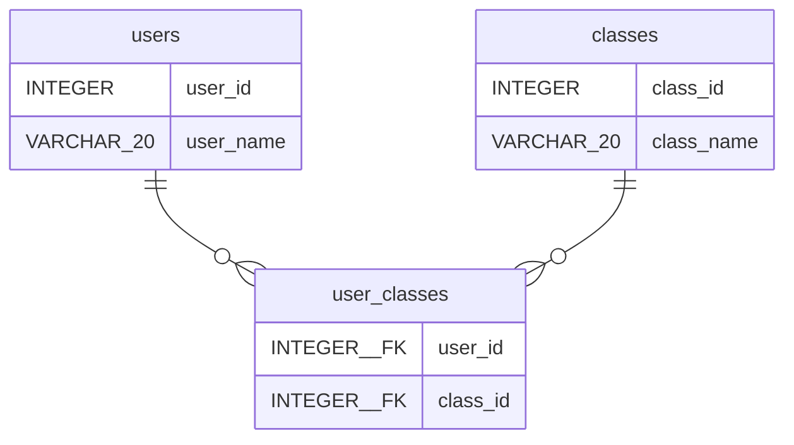

# ER図

```mermaid
erDiagram
    users {
        INTEGER user_id
        VARCHAR_20 user_name
    }
    user_classes {
        INTEGER__FK user_id
        INTEGER__FK class_id
    }
    classes {
        INTEGER class_id
        VARCHAR_20 class_name
    }

    users ||--o{ user_classes: ""
    classes ||--o{ user_classes: ""
```
