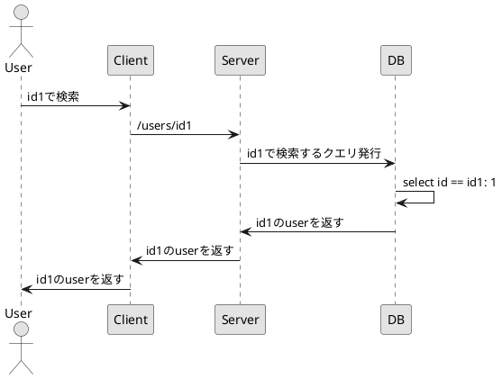
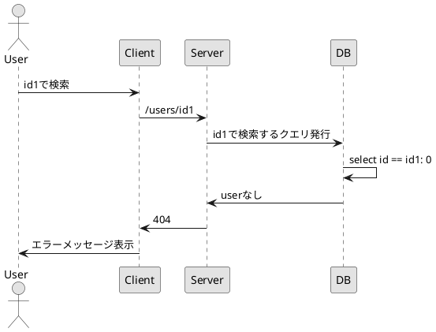

# シーケンス図

- [ID検索 成功](#id-search-success)
- [ID検索 失敗](#id-search-fail)

## ID search success

```puml
@startuml
skinparam monochrome true

actor User as U
participant Client as C
participant Server as S
participant DB as D

U -> C: id1で検索
C -> S: /users/id1
S -> D: id1で検索するクエリ発行
D -> D: select id == id1: 1
D -> S: id1のuserを返す
S -> C: id1のuserを返す
C -> U: id1のuserを返す

@enduml
```

## ID search fail

```puml
@startuml
skinparam monochrome true

actor User as U
participant Client as C
participant Server as S
participant DB as D

U -> C: id1で検索
C -> S: /users/id1
S -> D: id1で検索するクエリ発行
D -> D: select id == id1: 0
D -> S: userなし
S -> C: 404
C -> U: エラーメッセージ表示

@enduml
```
