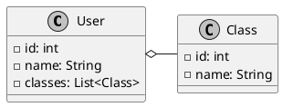

# クラス図

- [My Awesome Server](#my-awesome-server)

## My Awesome Server

```puml
@startuml
skinparam monochrome true

class User {
    - id: int
    - name: String
    - classes: List<Class>
}

class Class {
    - id: int
    - name: String
}

User o- Class

@enduml
```
