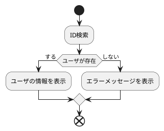

# フローチャート

- [ID検索](#id-search)

## ID search

ユーザをIDで検索した際のフローです。

```puml
@startuml
skinparam monochrome true

start
:ID検索;
if (ユーザが存在) then (する)
    :ユーザの情報を表示;

else (しない)
    :エラーメッセージを表示;

endif

end
@enduml
```
