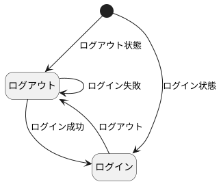

# 状態遷移図

- [認証](#認証)

## 認証

認証フローの状態遷移図です。

```puml
@startuml
skinparam monochrome true
hide empty description

[*] --> ログアウト: ログアウト状態
[*] --> ログイン: ログイン状態

ログアウト --> ログイン: ログイン成功
ログアウト --> ログアウト: ログイン失敗

ログイン --> ログアウト: ログアウト

@enduml
```
