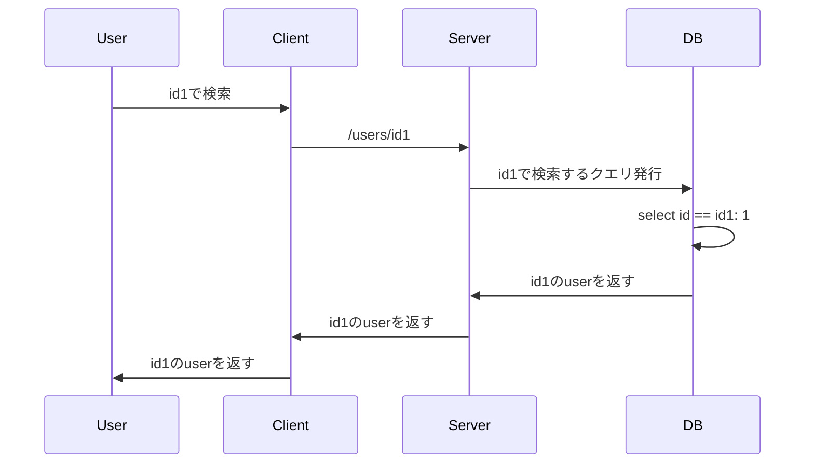
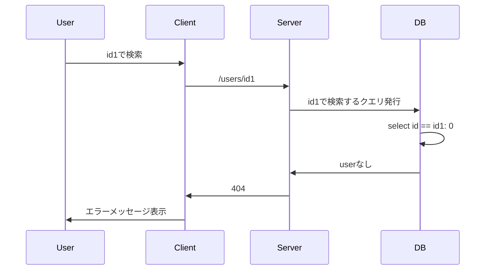

# シーケンス図

## ID search success

```mermaid
sequenceDiagram
    participant U as User
    participant C as Client
    participant S as Server
    participant D as DB

    U ->> C: id1で検索
    C ->> S: /users/id1
    S ->> D: id1で検索するクエリ発行
    D ->> D: select id == id1: 1
    D ->> S: id1のuserを返す
    S ->> C: id1のuserを返す
    C ->> U: id1のuserを返す
```

## ID search fail

```mermaid
sequenceDiagram
    participant U as User
    participant C as Client
    participant S as Server
    participant D as DB

    U ->> C: id1で検索
    C ->> S: /users/id1
    S ->> D: id1で検索するクエリ発行
    D ->> D: select id == id1: 0
    D ->> S: userなし
    S ->> C: 404
    C ->> U: エラーメッセージ表示
```
