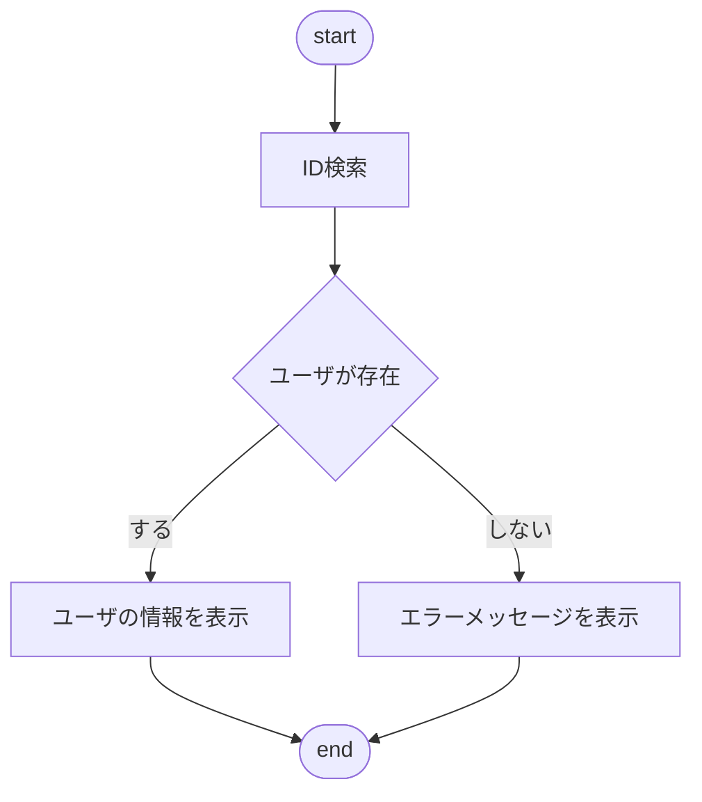

# フローチャート

## ID search

```mermaid
graph TD
    s([start])
    1[ID検索]
    2{ユーザが存在}
    3[ユーザの情報を表示]
    4[エラーメッセージを表示]
    e([end])

    s --> 1 --> 2
    2 -- する --> 3 --> e
    2 -- しない --> 4 --> e
```

ユーザをIDで検索した際のフローです。
