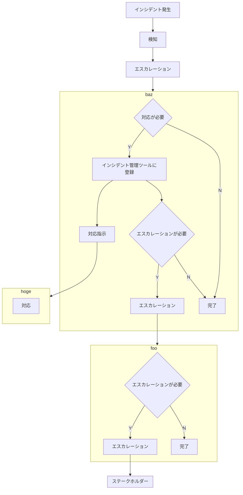

# My Awesome Project

My Awesome Projectは開発時に使用するドキュメントのテンプレートを作成するプロジェクトです。

プロジェクトを立ち上げてから閉じるまでに様々なドキュメントを作る必要があります。  
このプロジェクトの目的は、それらのコストを削減するためのテンプレートを用意することです。  
なお、成果物としてのドキュメントは対象としていません。

## 体制

企業別五十音順、敬称略

| 名前 | 企業名 | SlackのID | メールアドレス | 実行責任者 | 説明責任者 | 相談先 | 報告先 | 補足 |
| --- | --- | --- | --- |:---:|:---:|:---:|:---:| --- |
| foo | aaa | foo | foo@example.com | | 〇 | | 〇 | PM |
| bar | bbb | bar | bar@example.com | | | 〇 | 〇 | UI/UXに関する相談先 |
| baz | ccc | baz | baz@example.com | | 〇 | | 〇 | PL、開発リーダー |
| hoge | ddd | hoge | hoge@example.com | 〇 | | | | 開発メンバー |

## マイルストーン

- 2021-07
    - プロジェクトに関するドキュメントのテンプレート作成
- 2021-08
    - 英語版のテンプレート作成

## ツール

- [GitHub](#)
    - ソースコード管理
    - タスク管理
    - 情報管理
- [Zoom](#)
    - Web会議
- [Slack](#)
    - チャット
- [Microsoft SharePoint](#)
    - 情報管理
    - ファイル共有
- [AWS](#)
    - クラウド環境
- 000.000.000.000
    - オンプレサーバ

## コミュニケーション計画

| 種類 | 発信者・主催者 | 受信者 | 方法 | 頻度 | 備考 |
| --- | --- | --- | --- | --- | --- |
| 進捗共有 | チームメンバー | チームメンバー | Zoom | 毎週月曜 15:00-15:30 | |
| リスク共有 | foo | チームメンバー、ステークホルダー | 対面会議 | 必要に応じて | |
| インシデント報告 | チームメンバー | チームメンバー、ステークホルダー | Slack、電話、Zoom、対面会議 | インシデント発生時 | エスカレーションフローに従う |
| タスク管理 | チームメンバー | チームメンバー | GitHub | 随時 | |
| ファイル共有 | チームメンバー | チームメンバー | Microsoft SharePoint | 随時 | |
| ナレッジ共有 | チームメンバー | チームメンバー | GitHub | 随時 | |
| 設計レビュー | hoge | baz | GitHub | 随時 | |
| コードレビュー | hoge | baz | GitHub | 随時 | |
| 簡単な確認・報告・相談 | チームメンバー | チームメンバー | Slack | 随時 | 後で参照する可能性のある情報はチケットで管理する |

## エスカレーションフロー

