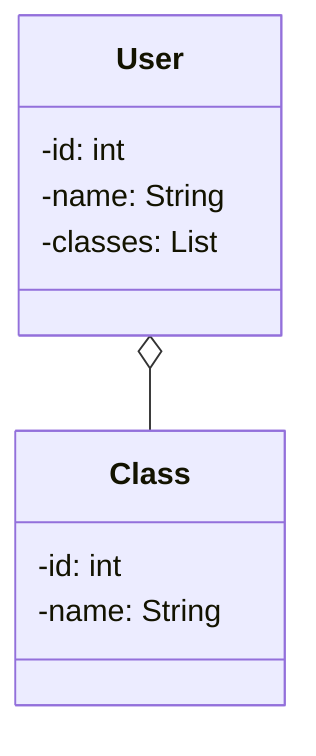

# クラス図

## My Awesome Server

```mermaid
classDiagram
    class User {
        -id: int
        -name: String
        -classes: List<Class>
    }
    class Class {
        -id: int
        -name: String
    }

    User o-- Class
```
