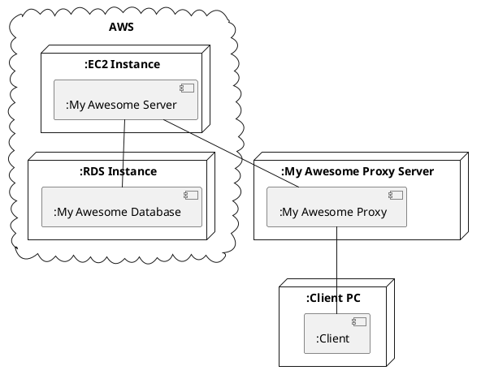

# 配置図

```puml
@startuml
skinparam monochrome true

cloud AWS {
    node ":EC2 Instance" {
        [:My Awesome Server] as server
    }
    
    node ":RDS Instance" {
        [:My Awesome Database] as db
    }
}

node ":My Awesome Proxy Server" {
    [:My Awesome Proxy] as proxy
}

node ":Client PC" {
    [:Client] as client
}

[server] -- [db]
[server] -- [proxy]
[proxy] -- [client]

@enduml
```

## My Awesome Server

アプリで扱うデータを管理するサーバです。

## My Awesome Database

アプリで扱うデータを管理するデータベースです。

## My Awesome Proxy

サーバとクライアントの間に挟み、セキュリティを向上させるためのプロキシです。

## Client

クライアントです。
