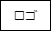
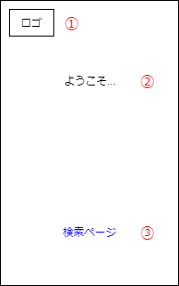
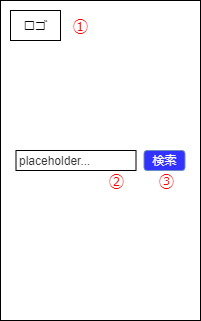
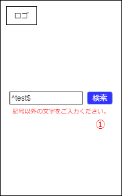
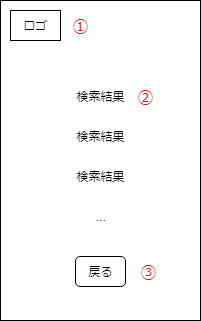

# 画面設計書

各画面の詳細を記載します。

## コンポーネント

### Logo

サイトロゴです。

#### アクション

| Name | Result | Description |
| -- | -- | -- |
| クリック | [Home](#home)に遷移 | |

## ページ

### Home

ホームページです。

1. [ロゴ](#logo)
2. ようこそメッセージ
    - 中央寄せ
3. 検索ページリンク
    - Page1へのリンク
    - 中央寄せ

#### アクション

| Name | Result | Description |
| -- | -- | -- |
| 初期表示 | 画面表示 | |
| 「検索ページリンク」クリック | [Page1](#page1)に遷移 | |

### Page1

検索ページです。

1. [ロゴ](#logo)
2. 検索ボックス
    - 検索文字列を入力するinput
    - プレースホルダーを表示(placeholder...)
3. 検索ボタン
    - 検索を実行するbutton

#### アクション

| Name | Result | Description |
| -- | -- | -- |
| 初期表示 | 画面表示 | |
| 「検索ボタン」クリック | 「検索ボックス」の内容を検証 OK: [Page2](#page2)に遷移 NG: [Page1 invalid](#page1-invalid)に遷移 | |

### Page1 invalid

バリデーションエラー時の検索ページです。エラーメッセージ以外は[Page1](#page1)と同様です。

1. エラーメッセージ
    - 検索文字列に対するバリデーションエラーのメッセージ
    - 赤文字

### Page2

検索結果ページです。

1. [ロゴ](#logo)
2. 検索結果
    - 件数に応じて無限スクロール
3. 戻るボタン
    - Page1に戻るbutton

#### アクション

| Name | Result | Description |
| -- | -- | -- |
| 初期表示 | 画面表示 | |
| 「戻るボタン」クリック | [Page1](#page1)に遷移 | |
